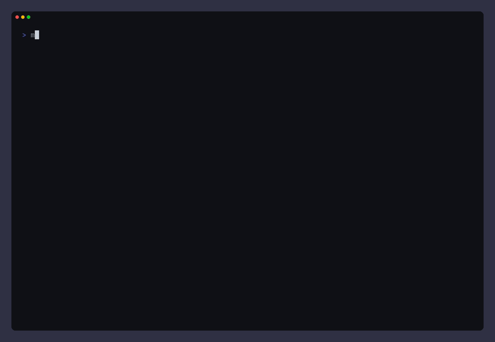
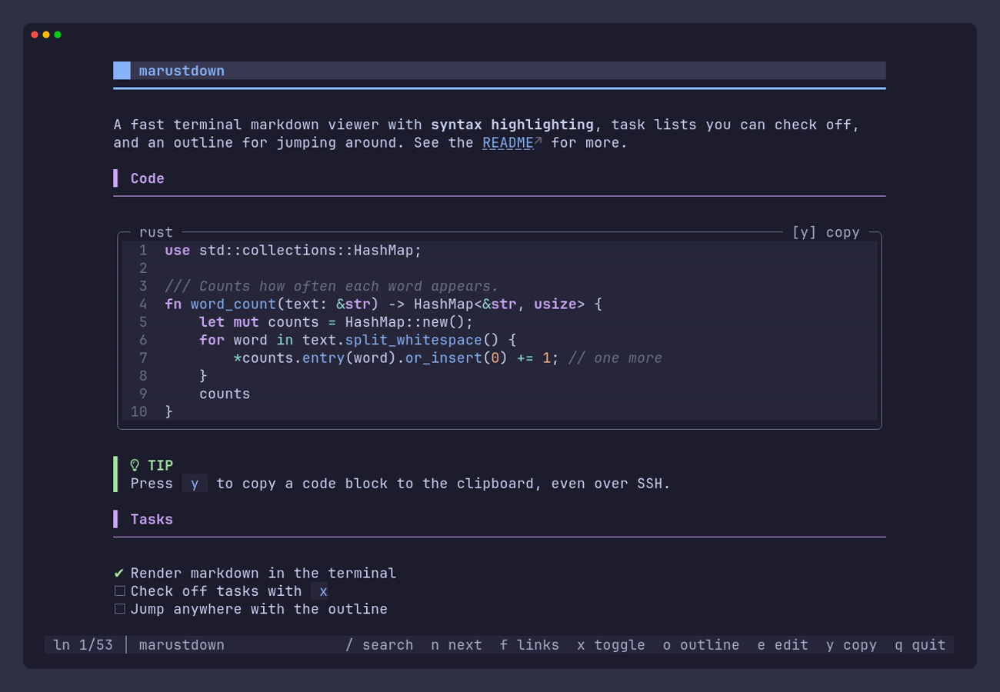
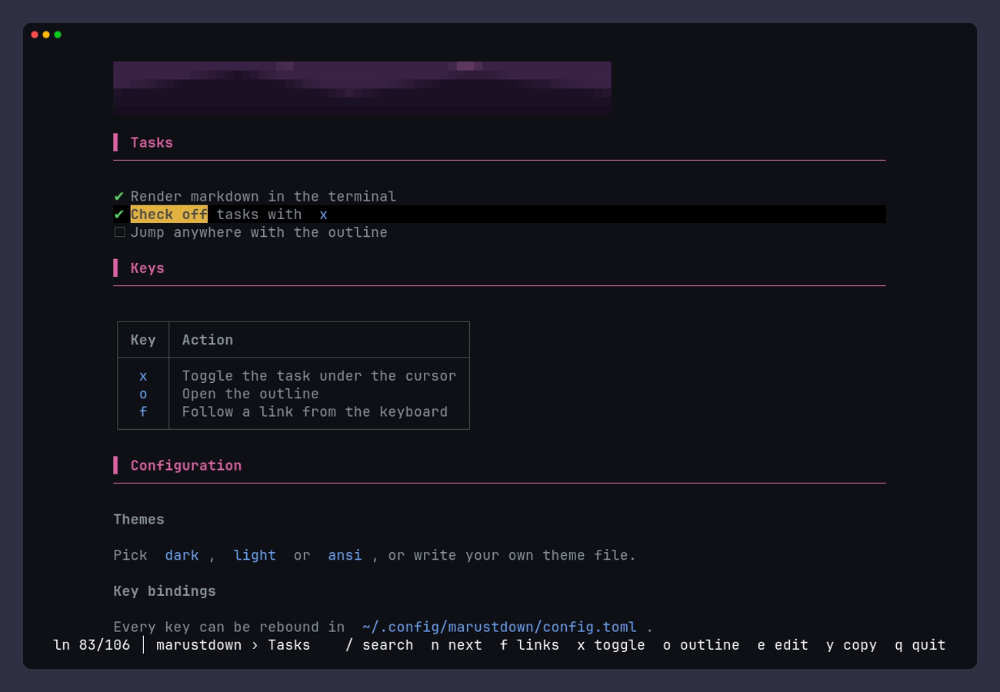
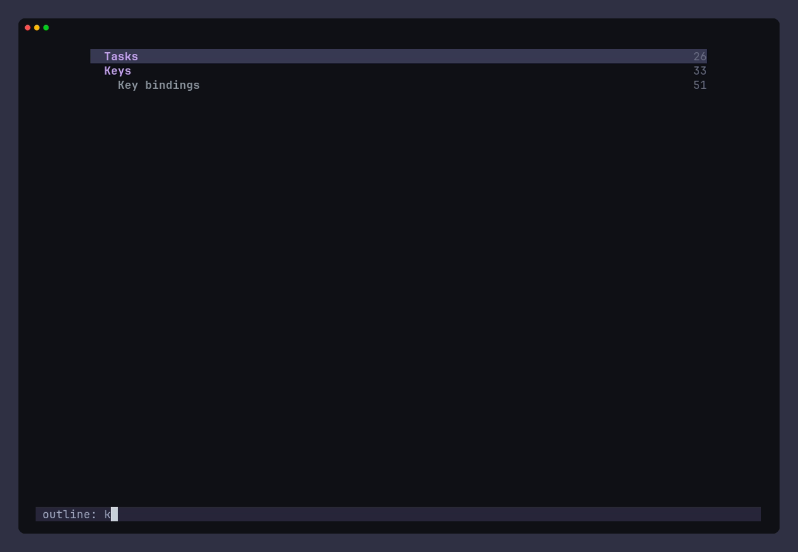

# marustdown

A fast terminal markdown viewer. It renders GitHub-flavored markdown with real
typography (headings, code boxes with syntax highlighting, tables, alerts, task lists)
in a full-screen pager, and every color, glyph and key can be changed in one TOML file.



## Features

- **Pager** with a cursor line, search, heading jumps and a breadcrumb of the current section.
- **Task lists you can check off.** Toggling a task writes `[ ]` ↔ `[x]` back to the file.
- **Keyboard link following.** `f` tags every visible link, and typing a tag opens it
  (in uppercase, it copies the URL instead). Tab and Shift-Tab step through links, and Enter
  opens the selected one. `#anchors` jump within the page, linked `.md` files open in
  the viewer with a back history, and everything else goes to `xdg-open`.
- **Outline picker.** Filter the headings by typing, then jump to one.
- **Edit in `$EDITOR`** at the cursor's source line, and see the result when you return.
- **Copy code blocks** to the system clipboard with OSC 52, which also works over SSH.
- **Syntax highlighting** for about 220 languages, using syntect with bat's syntax
  definitions from two-face. Colors come from your theme, not from a separate
  highlighting theme.
- **Clickable links** (OSC 8) in terminals that support them.
- **Cat mode** prints the rendered document to stdout, and is used automatically when
  output is piped or redirected. Output is styled on a terminal and plain text otherwise.
- **Fully configurable**: themes, per-element styles, glyphs, layout and key bindings.
- **Fast and small**: memory-mapped input and a flat three-buffer layout with no
  per-line allocations. Highlighting is cached per code block, so resizing never
  re-highlights. The release binary is about 3 MB.

## Screenshots

| Syntax highlighting | Task lists | Outline |
|---|---|---|
|  |  |  |

The screenshots are generated with [VHS](https://github.com/charmbracelet/vhs): run
`cargo build --release && vhs docs/demo.tape` to regenerate them.

## Install

Requires Rust 1.88 or newer and a C compiler, which builds the Oniguruma regex engine
that syntect uses.

```sh
cargo install --path .
```

This installs the `mar` binary. Alert icons use [Nerd Font](https://www.nerdfonts.com/)
glyphs; without one, run with `--no-icons` or set `icons = false`.

## Usage

```sh
mar README.md            # page a file
mar README.md --cat      # print the rendered document and exit
cat notes.md | mar       # read stdin (`mar -` works too)
mar doc.md > doc.txt     # redirected output is plain, readable text
mar --color always doc.md | less -R   # keep the styling when piping
```

| Option | |
|---|---|
| `--cat` | Print and exit instead of paging |
| `--color <WHEN>` | `auto` (default: styled only on a terminal), `always`, or `never` |
| `--width <N>` | Maximum content width (default 90) |
| `--theme <NAME>` | `dark`, `light`, `ansi`, or a custom theme file |
| `--no-color` | Same as `--color never`; `NO_COLOR` also turns colors off |
| `--no-icons` | ASCII glyphs instead of Unicode and Nerd Font icons |
| `--config <PATH>` | Use this config file instead of the default location |

### Keys

| Key | Action |
|---|---|
| `j` `k` / `↓` `↑` | Move the cursor |
| `Space` / `b`, `PgDn` / `PgUp` | Page down / up |
| `d` / `u` | Half page down / up |
| `g` / `G` | Top / bottom |
| `]]` / `[[` | Next / previous heading |
| `/` then `Enter`, `n` / `N` | Search (smart case), next / previous match |
| `f` then a tag | Open that link; type the tag in uppercase to copy its URL |
| `Tab` / `Shift-Tab` | Select the next / previous link |
| `Enter` | Open the selected link, or toggle the task under the cursor |
| `Backspace` | Go back to the previous file after following a link |
| `x` | Toggle the task under the cursor (saved to the file) |
| `o` | Outline: type to filter, `↑` `↓` to pick, `Enter` to jump, `Esc` to close |
| `e` | Open `$VISUAL` / `$EDITOR` at the cursor line, then reload |
| `y` | Copy the code block at the cursor |
| `q` / `Esc` | Quit (`Ctrl-C` always quits) |

Every binding except `Ctrl-C` can be changed, see [docs/configuration.md](docs/configuration.md#keys).

## Configuration

Config file: `~/.config/marustdown/config.toml` (or `$XDG_CONFIG_HOME/marustdown/config.toml`).
Every key is optional; set only what you want to change.

```toml
theme = "light"          # dark, light, ansi, or a file in ~/.config/marustdown/themes/

[layout]
width = 100

[styles.h1]
fg = "#ff8800"

[keys]
toggle = ["space"]
```

The full reference is in [docs/configuration.md](docs/configuration.md), and every
default is in [assets/config.toml](assets/config.toml).

## Notes

- Links to local markdown files are resolved against the current file's directory, and
  a `#fragment` jumps to the matching heading using GitHub's anchor rules. External links
  open with `xdg-open` (`open` on macOS).
- A code block's language is looked up by the name after the fence, either a file
  extension (`rs`, `py`, `ts`) or a language name (`rust`, `Dockerfile`). Unknown
  languages are shown without highlighting.
- Copying needs a terminal that supports OSC 52. Under tmux, also set `set -g set-clipboard on`.
- Toggling a task checks that the file still has a task box at that spot before writing,
  so a file edited behind the viewer's back won't be corrupted.
- Input from stdin can be viewed and its tasks toggled, but those changes aren't saved.

## Development

```sh
cargo test
cargo clippy --all-targets
```

`source` memory-maps the input, `layout` turns pulldown-cmark events into a `Document`
(flat text, style runs and line ends, with no escape codes), and `render` and `pager`
turn that into terminal output without knowing anything about markdown.

## License

[MIT](LICENSE)
