# Mermaid

## Flowchart top-down

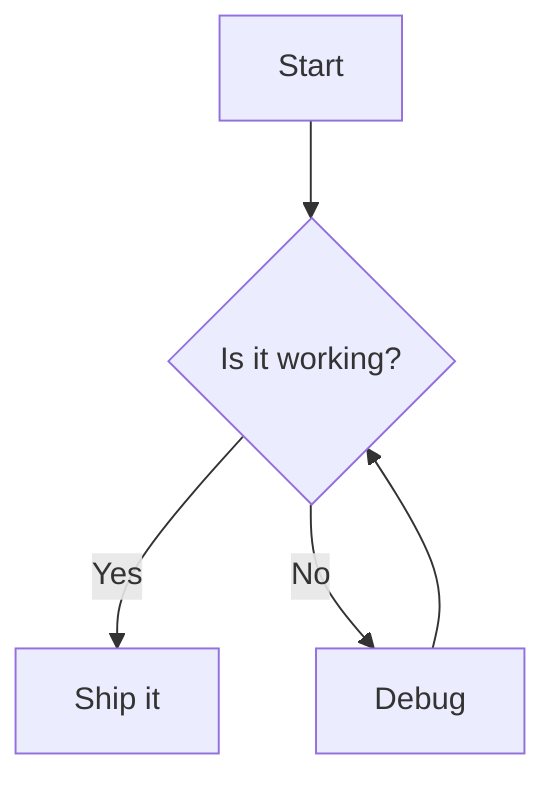

## Flowchart with subgraphs and edge styles

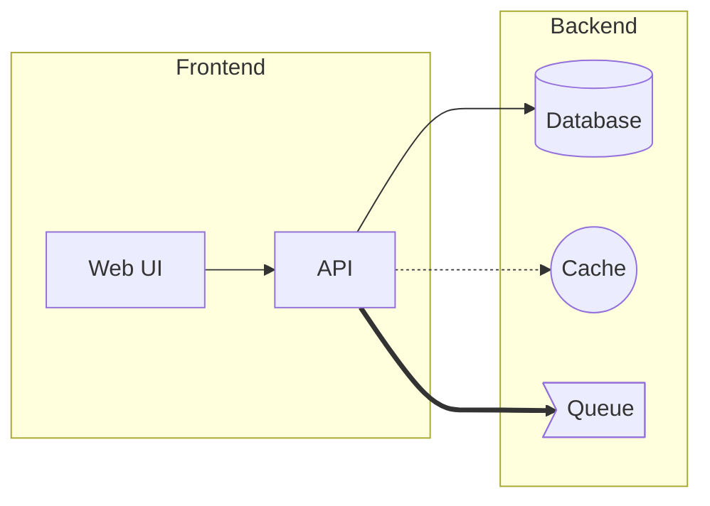

## Sequence with notes and loops

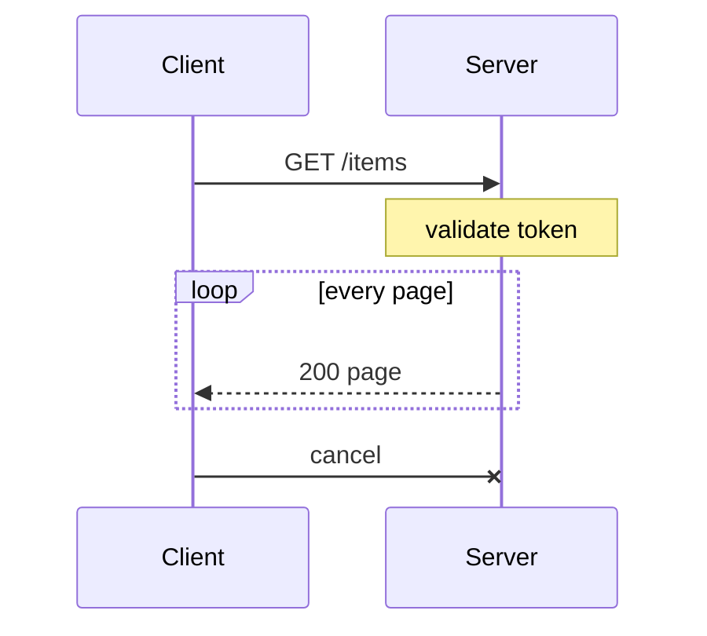

## State

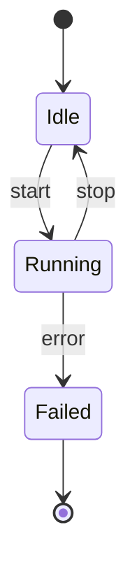

## Class (ASCII names)

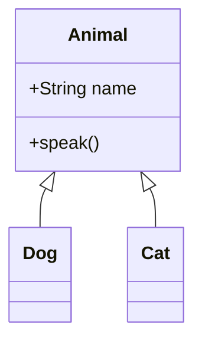

## Class with a non-ASCII name (crashes mermaid-text; must show the source)

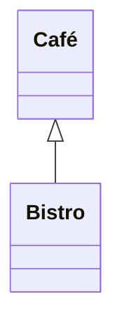

## Pie

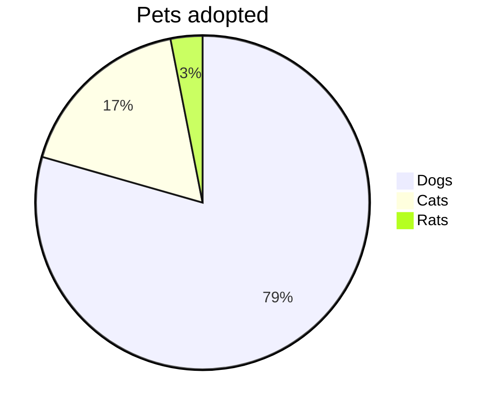

## Gantt

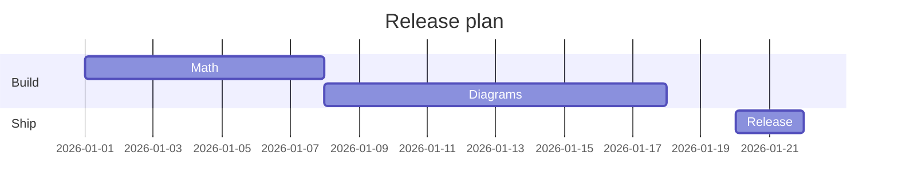

## Entity relationship

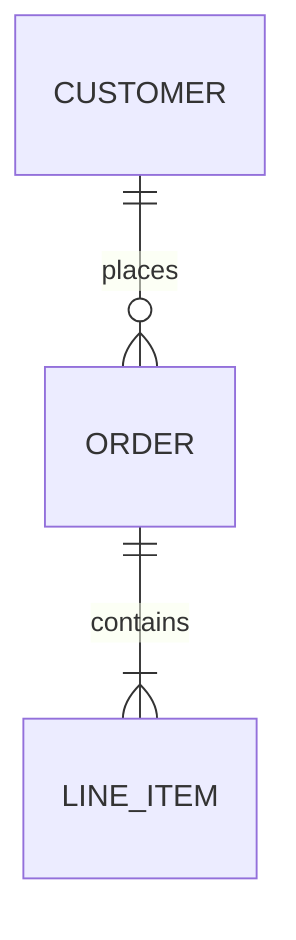

## Journey, mindmap, timeline, git graph

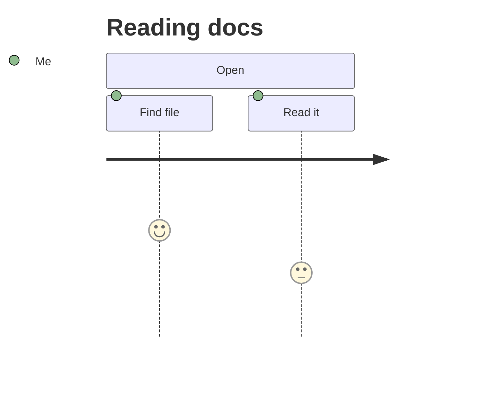

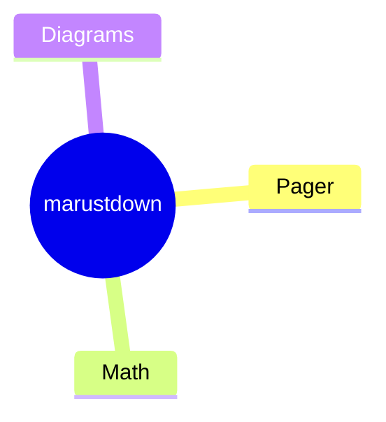

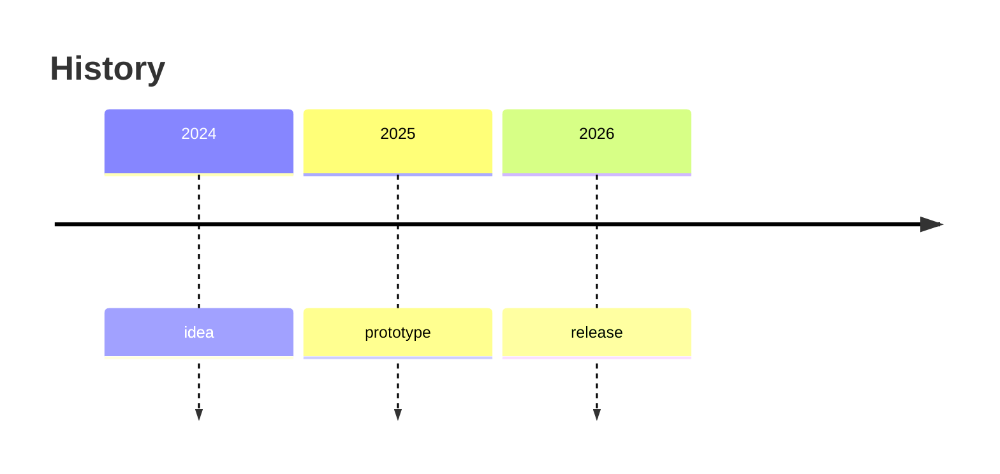

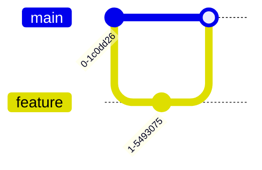

## Broken and odd input (all must show the source, no crash)

```mermaid
graph TD
    A[unclosed --> B{{{
```

```mermaid
notADiagramType
    whatever
```

```mermaid
```

```mermaid
%% only a comment
```

```MERMAID
graph LR
    upper --> case
```

## Big flowchart

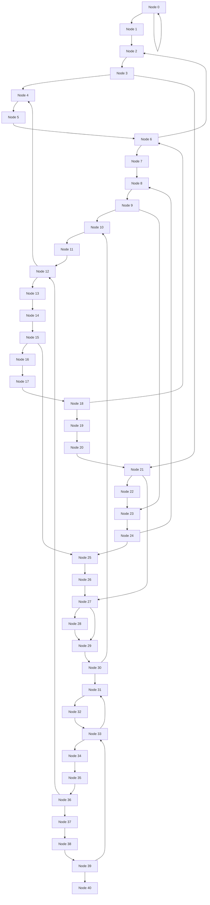
